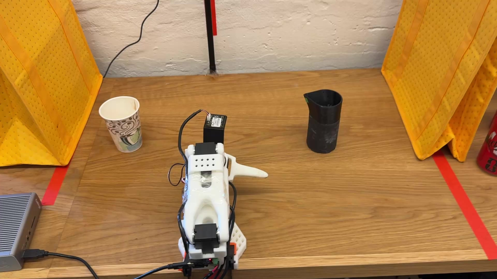
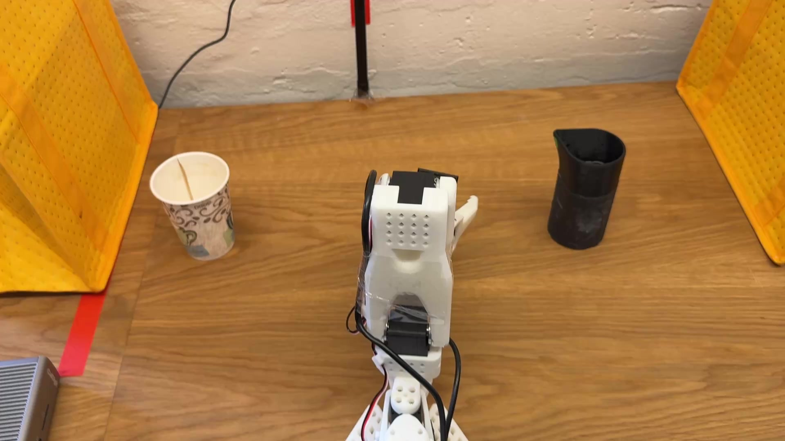

# Physical AI Hackathon - ETA 0.1

## Demo Videos

### ACT Fine-tuned on 50 Demonstrations

### ACT with Perturbation

---

## Overview

*[Add your project description here]*

## Team

*[Add team members here]*

## Technical Approach

*[Add technical details here]*

## Results

*[Add results and findings here]*

## How to Run

*[Add setup instructions here]*

---

*Submitted for Physical AI Hackathon 2026*
